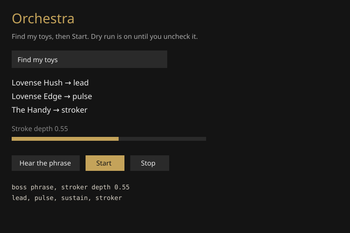

# D2R XP Pulse

Hands-free toy feedback for Diablo II: Resurrected. An XP rise drives a trash pulse, a boss phrase, a jackpot, or a level-up celebration. Several toys can play as an orchestra. A linear stroker is its own part. Intiface or Lovense. Screen capture only.



That picture is a mock of the orchestra window, not a live capture.

## Start

```bash
pip install -r requirements.txt
python d2r_xp_window.py
```

Or double-click `start.bat`. Be in game, bar visible.

1. Find bar, or Drag crop if it grabs the wrong gold.
2. Test. Dry run starts on.
3. Uncheck dry run once the toy is connected.
4. Start. F8 pauses. F10 stops and writes the session card.

Several toys or a stroker:

```bash
python d2r_xp_multi.py
```

Find my toys. Vibrators become lead, pulse, and sustain. A LinearCmd device becomes the stroker. Hear the phrase, then Start.

## Features

- XP bar watch. Small rise is trash. Large rise is boss. Very large rise is jackpot.
- Streak. Kills close together climb. At 3, a wave. At 10, a finale.
- Named patterns: pulse, wave, stairs, earthquake.
- Near-level tease once the bar is past about 90%.
- Level-up celebration when the bar drops. Not counted as a kill.
- Death screen cuts the motors.
- Town silence. Elites only. Ceiling that wins over the sliders.
- Profiles, drag-to-crop, gold-mask preview, session card.
- Orchestra: lead, pulse, sustain, plus a controlled stroker. Depth starts at 0.55. Speed is a slider.
- Intiface and Lovense. F8 pause. F10 stop.

Quest XP, corpse pickup, and nearby party credit can still fire. It does not read monster names or game memory.

## Files

- `d2r_xp_window.py` main window
- `d2r_xp_multi.py` orchestra and stroker
- `d2r_xp_pulse.py` command line
- `d2r_xp_pulse_ui.py` older window
- `start.bat` opens the main window

MIT.
